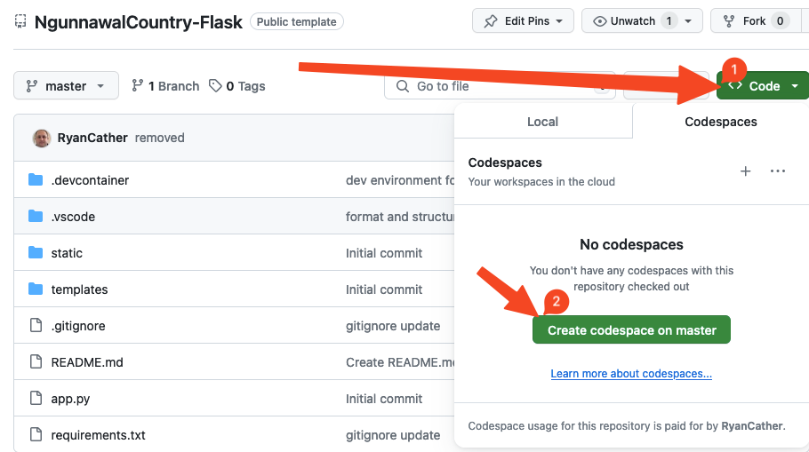
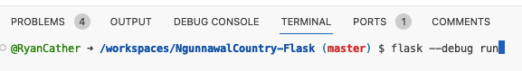
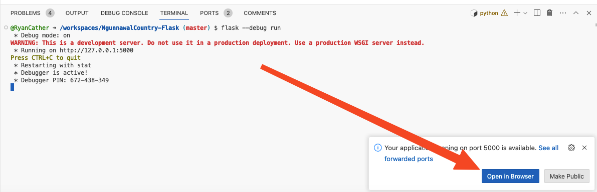

[](https://classroom.github.com/open-in-codespaces?assignment_repo_id=13869754)
# NgunnawalCountry-Flask

This is the initial project structure to build the Ngunnawal Country Flask project.

## Open the Project

To run this project, open the project in a new or existing Code Space



## Run the Project

Once the project has fully opened, run the project by typing the following into the terminal:

```
flask --debug run
```



Once completed, you'll be prompted to open the project in a new browser window.

