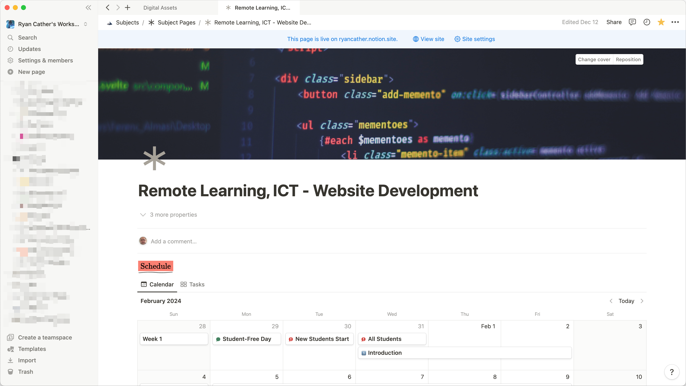
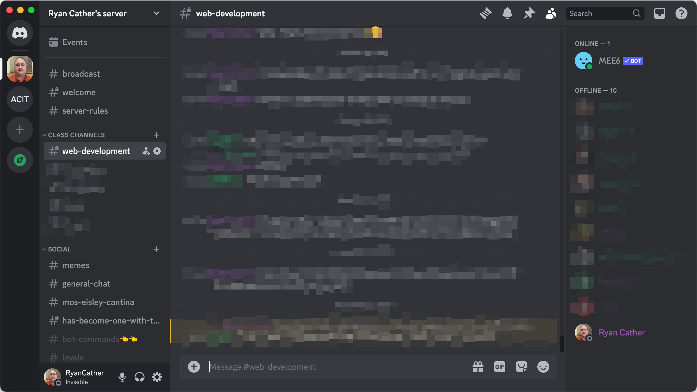

<!-- _footer: Website Development, Remote Learning -->

# Web Development

Welcome to Website Development. 

This course will be delivered **entirely remotely**.

eh, maybe 99%. Some face-to-face sessions may be required.

---
<!-- _header: Subject / Technical Requirements -->
<!-- _footer: Website Development, Remote Learning -->

## Permissions
Parents / Guardians need to complete the permissions form for external sites.

**Very** important before continuing.

Parents / Guardians have been emailed the link.

---
<!-- _header: Permissions -->
<!-- _footer: Website Development, Remote Learning -->

# Github
- Create a [Github](www.github.com) account using your schoolsnet email address

Accept the Github Classroom Assignment (link on subject website)

---
<!-- _header: Permissions -->
<!-- _footer: Website Development, Remote Learning -->

# Notion
- Create a [Notion](notion.so) account using your schoolsnet email address.

This site will be used for project management.

---

--- 
<!-- _header: Permissions -->
<!-- _footer: Website Development, Remote Learning -->

# Discord

- Log into the Discord server. 
- Introduce yourself (name & class) and you will be assigned to the correct class.

Discord will be used for communication and collaboration.

---

---
<!-- _header: Section Title -->
<!-- _footer: Website Development, Remote Learning -->

---
<!-- _header: Conclusion -->
<!-- _footer: Website Development, Remote Learning -->
<!-- # Note: Speaker Notes example -->

# Thanks!

If you need to contact me at any stage, use email or discord.

Ryan Cather
ryan.cather@ed.act.edu.au

